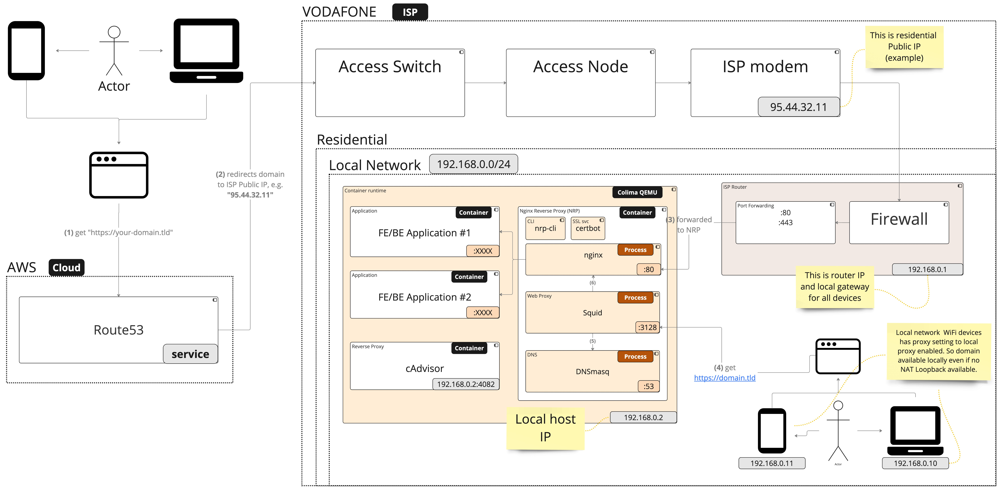

# nginx-reverse-proxy

* [Goal](#goal)
* [Context](#context)
* [How to start](#how-to-start)
  * [Prerequisites](#prerequisites)
  * [Bootstrap](#bootstrap)
* [Additonal features](#additonal-features)
* [Solution description](#solution-description)
  * [Other options](#other-options)
* [Troubleshooting](#troubleshooting)

## Goal

* To have Nginx reverse-proxy for multiple aplication hosted locally
* Accessible from the WWW by domain name using HTTPS
* No ISP NAT-loopback, and no public static IP tolerant
* Dockerized and configured by single config file - `nrp.yaml`

## Context

* Platform - `Mac M1` & `Linux`. It should work on Windows, but was not tested
* No Static Public IP (I don't have it and don't want to pay €14/mo just for it)
* ISP `NAT loopback` not available, i.e local device can't access services using its public IP address from within the same network. It means that one can't access `your-domain.tld` proxied service from the same network
  * If one have public static IP and NAT-loopback the live will be just easier :-)

## How to start

### Prerequisites

* Docker setup
  * Install `docker` (using `colima` or `docker desktop` wrappers)
  * Check if `docker` default context uses proper socket

    ```bash
    colima status # will output socket path
    docker context ls #check for default (*) context socket link
    # if it shows error or socket path is wrong, then update it via DOCKER_HOST vars, e.g. for zshrc
    echo "export DOCKER_HOST=unix:<path-to-socket>/docker.sock" >> ~/.zshrc
    # restart shell
    docker context ls # check socket path again
    ```

### Bootstrap

**Note:** Nginx-Reverse-Proxy = NRP

1. Copy `project.env.dist` to `project.env` and set the values
    * AWS related values make sense to use only if you plan to use automatic public IP check & update.
    * If you plan to use Route53 IP automatic updates for your current public IP, it is recommended to emit credentials with limited to Route53 access only via AWS IAM.
2. Set desired sub/domain(e.g. `your.domain.tld`) `A` record pointing to the ISP public IP ([portchecker](https://portchecker.co/) can help to check public IP and open ports)
3. Setup port forwarding for NRP on your router:

    * Local server network IP, e.g. `192.168.0.111`
    * `TCP/UDP 192.168.0.111 :80 → :80`
    * `TCP/UDP 192.168.0.111 :443 → :443`

4. Add services to `nrp.yaml`
  
    * Assume your services executed on the same host as nginx, and host has local IP = `192.168.0.111`. Also you had configured `service1.domain.tld` & `service1.domain.tld` redirect to your ISP public IP. And your services listening ports `9000` and `9001` respectfuly 
    * Create `nrp.yaml` file in root repo folder, e.g.:

      ```yaml
      schemaVersion: 0.3.0
      letsencrypt:
        email: "you-name@gmail.com"
        dryRun: false
      services:
      - name: service1 # plain HTTP
        serviceIp: 192.168.0.111
        servicePort: 9000 # your service port
        domainName: service1.domain.tld
        cors: true
      - name: service2 # with HTTPS
        serviceIp: 192.168.0.111
        servicePort: 9100 # your service port
        domainName: service2.domain.tld
        cors: true
        https: 
          use: true
          force: true 
          hsts: true
      ```

      **Notes:** use your real email for SSL certificates

5. Start NRP by `make restart`

    * [`nrp-cli`](https://github.com/oleksii-honchar/nrp-cli) internally will created necessary `nginx` config files and start `certbot` if https needed
    * `dnsmasq` and `squid` config wil be generated according to `nrp.yaml`
    * `certbot` will run every 1d to renew certificates via `cron`

    **Note**: at this point described services should be available locally using their domains in browser
6. Other network clients access to proxied services
   * If you added domains in `/etc/hosts` you do not need to use `squid` proxy on that particular host. Otherwise, go to host System Settings → Network → Wi-Fi (or your selected active connection) → Advanced → Proxies. 
      * Add `<local-host-ip>` with `port=<SQUID_PORT>` as proxy(e.g. `proxy=192.168.0.111, port=3128`).
   * Do the same for Wi-Fi clients, which need to access `your-domain.tld` from local network
   * Now all local and Wi-Fi DNS and HTTP/S requests will be proxied through the `squid`

## Additonal configuration features

* In case when no static public IP available, then `public-ip` check can be enabled by config option (check details in [nrp-cli doc](https://github.com/oleksii-honchar/nrp-cli#configuration-schema)):

    ```yaml
    public-ip:
      checkAndUpdate: yes
      schedule: 1h # default, can be omited
      dryRun: no # default, can be omited
    ```

* In case you don't need `squid` & `dnsmasq` to proxy local requests (check details in [nrp-cli doc](https://github.com/oleksii-honchar/nrp-cli#configuration-schema)):

    ```yaml
    squid:
      use: no
      useDnsmasq: no
    ```

* In case of possible DNS issues one can enabel dnsmasq logging:

    ```yaml
    dnsmasq:
      logs: yes
    ```

## Solution description

With NAT loopback disabled by the ISP, local network devices cannot access the proxied service using the `your-domain.tld` name. There are various options available for solving this problem, which are described below for educational purposes. The current solution utilizes a non-root `docker-compose` approach with `squid` and `dnsmasq`. Custom `arm64` `squid` image used to disable file logs and pipe them to docker native logs to manage log rotation on docker-compose level. Also, custom image of `cadvisor` used since there is no official `arm64` version(by 3/10/23).

Configuration for `squid` and `dnsmasq` updated by `generate-config.bash` script on every docker  `make <command>`. One just need to have `project.env` properly filled.

Here is the deployment diagram for the solution:


**Description:**

1. External user flow
    * (1) - External internet user makes request to `your-domain.tld`
    * (2) - DNS (AWS in this case) resolve it to the ISP Public IP 
    * (3) - When request reaches local network ingress, router it redirects it to local NRPs `:80` or `:443` ports. Then it resolves to configures local network service according to NRP configuration
2. Local user flow
   * (4) - User from the same residential network make request to the `your-domain.tld` from his browser. And his network already configured to use proxy. Which in fact is `Squid` proxy server running in the docker-compose configuration with NRP 
   * (5) - `Squid` configured to resolve domains using `dnsmasq`. Which is aware of `your-domain.tld` to be forwarded to NRP `multi-proxy` network IP. 
   * (6) - When domain name IP resolved, `squid` proxied requests to `nginx`

**Notes**

* This is known tradeoff - with `squid` proxy & `dnsmasq` enabled on your local devices, all their DNS and HTTP traffic will go through the `squid` & `dnsmasq` on host machine. On "Macbook Pro M1" it utilizes ~0.02 cores


* There is [cAdvisor](https://github.com/google/cadvisor) on port `:4082` present in docker-compose in order to monitor resource utilization

* Locally `dig` and `nslookup` will resolve your domain to Public IP, but it's okay, because every HTTP/S request will be processed by `squid <-> dnsmasq -> nginx-proxy-manager` when made from local network with proxy setting configured

### Other options

Described options leaves considerable system footprint, hardly scalable or requires significant manual effort:

<details>

<summary>Option #1 - when you don't need to access domain locally frequently - use Brave Tor</summary>

To access your reverse-proxy resource by domain name you need to access it from different internet connection (if your ISP doesn’t support NAT loopback)
* Open “New Private Window with Tor” (Brave)
* Connect via mobile hotspot from other device
* Use Android “HTTP shortcuts” app with mobile connection (disabled WiFi)

</details>

<details>
<summary>Option #2 - when few hosts in local network need access - update /etc/hosts</summary>

Or you can you local domain forward by adding your domain and IP address to the `/etc/hosts` file. You may have to use sudo or editor.

```text
echo "127.0.0.1 sub.<your-domain>.com" >> /etc/hosts
dscacheutil -flushcache # Flush the DNS cache for the changes to take effect
```

</details>

<details>
<summary>Option #3 - when Wi-Fi hosts or many hosts need acces via domain name - use dnsmasq + squid</summary>

Setup `dnsmasq`

* `brew install dnsmasq`
* To start dnsmasq now and restart at startup

  ```bash
  sudo brew services start dnsmasq
  ``` 

* Copy the default configuration file. And set your domain resolution to IP

  ```bash
  edit /opt/homebrew/etc/dnsmasq.conf
  # add "address=/test.my-domain.com/127.0.0.1"
  # uncomment for logging "log-queries"
  # add "log-facility=/var/log/dnsmasq.log"
  # add server "server=8.8.8.8"
  # uncomment and add "listen-address=127.0.0.1"
  sudo brew services restart dnsmasq
  ```

* Go to System Settings → Network → Wi-Fi (or your selected active connection) → Advanced → DNS.
  Then, add `127.0.0.1` to your DNS Servers.
* Flush DNS cache:

  ```bash
  sudo killall -HUP mDNSResponder
  ``` 

* ping your domain to check if it resolved locally:

  ```bash
  ping test.my-domain.com
  ```

**Notes:**

* test resolution

  ```bash
  dig example.dev
  nslookup example.dev
  ping example.com
  ```

Setup `squid`

The thing is, that your local network wi-fi mobiles still not able to resolve your domain locally (because only rooted Android allowed to change `/etc/hosts`). So, let's try local web proxy then with `squid` & `dnsmasq`

* When dnsmasq installed
* Add to dnsmasq config 
  * `edit /opt/homebrew/etc/dnsmasq.conf`
  * dhcp-option=252,”http://127.0.0.1:3128/wpad.dat”
* Now let's setup `squid`

```bash
brew install squid
cp /opt/homebrew/etc/squid.conf /opt/homebrew/etc/squid.conf.back
edit /opt/homebrew/etc/squid.conf
```

* Replace config with the following allow-all simple config:

```bash
# Squid normally listens to port 3128
http_port 3128

# We setup an ACL that matches all IP addresses
acl all src all

# We allow all of our clients to browse the Internet
http_access allow all

# We strongly recommend the following be uncommented to protect innocent
# web applications running on the proxy server who think the only
# one who can access services on "localhost" is a local user
#http_access deny to_localhost
```

* `squid -z` to check conf
* `sudo brew services restart dnsmasq`
* `brew services restart squid` - non-root!
* check logs
  * log file `/opt/homebrew/var/logs/cache.log`
  * access log `/opt/homebrew/var/logs/access.log`
* Now go to your mobile, open "WiFi settings" -> Proxy -> manual -> 
  * set IP : `192.168.0.??` (set your squid server ip)
  * set port: `3128`
* Check your domain `test.my-domain.com` from mobile browser, now it should be resolved via squid -> dnsmasq -> NRP -> your local server!!!
**Note:**
* By doing this all DNS & HTTP traffic from mobile clients browser (with configured proxy) and local DNS requests will go through `dnsmasq` and `squid`.

</details>

## Troubleshooting

* if certbot failed to make request, try dryRun option for testing and check docker network to be `bridge` without additonal subnets and static ip defined
